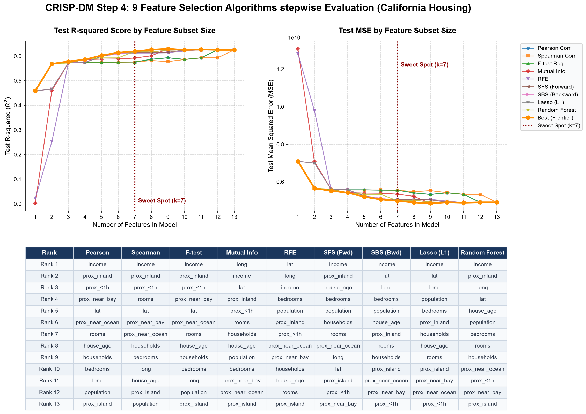

# California Housing Feature Selection Stepwise Evaluation (CRISP-DM Step 4)

This repository implements the **CRISP-DM Step 4 Stepwise Feature Selection Evaluation** on the California Housing dataset. It ranks features using **9 distinct feature selection algorithms**, evaluates them incrementally ($k \in [1, 13]$) using Linear Regression, generates a publication-quality dual-metric figure with a ranked table, and provides an interactive Streamlit dashboard.

---

## 📊 Evaluation Chart & Table

Below is the core output visualization generated by the pipeline:



### Key Results
- **Sweet Spot ($k=7$)**: Programmatically identified as the optimal number of features. Increasing features beyond 7 leads to diminishing returns in $R^2$ and MSE.
- **Top Features**: `median_income` (income) is consistently ranked as the most important feature (Rank 1). `ocean_proximity_INLAND` (prox_inland) is identified as the second most critical feature (Rank 2), showing location category heavily drives California home prices.

---

## 🚀 Features of the Streamlit Dashboard

Launch the Streamlit app to interact with the models in real-time:
1. **📊 Stepwise Evaluation Tab**: Displays the combined plot and ranked table. Recalculates dynamically if test-split ratio or evaluator model (e.g. Ridge, Random Forest) is adjusted.
2. **🔍 Algorithm Details Tab**: Provides feature rankings side-by-side with line graphs showing trend curves for each selection algorithm.
3. **🔮 Interactive Predictor Tab**: Trains a model on the top $k$ features of your chosen algorithm. Offers interactive sliders/inputs for these top features and yields a real-time home value prediction.
4. **🗺️ Dataset Explorer Tab**: Features statistics tables, a correlation heatmap, and a **geospatial map of California** indicating housing listings where bubble sizes represent population and colors represent property values.

---

## 🛠️ Setup and Execution

### 1. Installation
Run the PowerShell setup script to install dependencies (`scikit-learn`, `matplotlib`, `seaborn`) and verify the environment:
```powershell
powershell -ExecutionPolicy Bypass -File .\setup.ps1
```

### 2. Run Feature Selection & Generate Plot
Execute the python script to download the dataset, calculate rankings, evaluate them stepwise, and save the combined figure as `california_housing_feature_selection.png`:
```bash
python feature_selection.py
```

### 3. Run Streamlit Interactive Web App
Launch the interactive web application:
```bash
streamlit run app.py
```
Open [http://localhost:8501](http://localhost:8501) in your browser.

---

## 📂 File Structure

* `setup.ps1` - PowerShell setup and verification script.
* `feature_selection.py` - Core machine learning and plotting script.
* `app.py` - Streamlit interactive dashboard.
* `housing.csv` - Cached copy of the California Housing dataset.
* `california_housing_feature_selection.png` - Generated combined visual report.
* `california_housing_workflow.drawio` - Draw.io XML workflow diagram.
* `california_housing_workflow.png` - Rendered workflow flowchart PNG image.
* `save_model.py` - Script to train the model on sweet-spot features and serialize it.
* `california_housing_pipeline.joblib` - Serialized model pipeline containing the model, scaler, and top features.
* `hw7.md` - Homework summary report with Mermaid diagram (Traditional Chinese).
* `README.md` - Repository overview (English).
