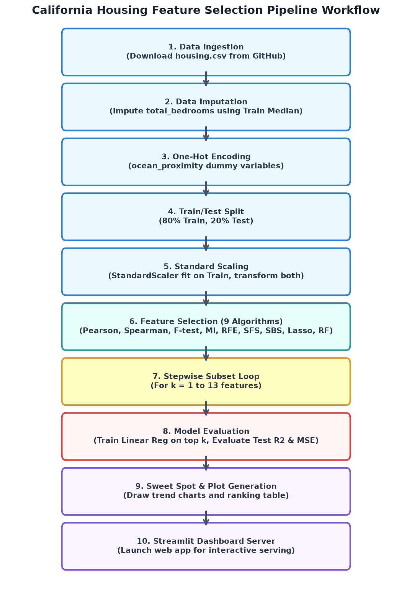
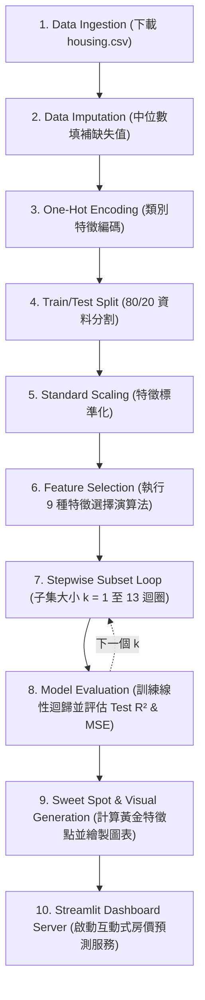

# AI 課程作業七：特徵選擇步進評估 (CRISP-DM Step 4)

**學生姓名：** 曾昱誠  
**作業日期：** 2026-06-15

---

## 1. 作業目標
本作業旨在於 **California Housing (加州房價)** 資料集上，實作 **CRISP-DM 流程之第四步驟 (特徵評估與選擇)**。我們實作了 9 種不同的特徵選擇演算法，並以「步進式 (Stepwise Evaluation)」的方法評估不同特徵子集數量 ($k \in [1, 13]$) 對線性迴歸模型在測試集上的表現影響（以 Test $R^2$ 與 Test MSE 為指標），並繪製高畫質雙圖表與排序表，進而找出最佳的「Sweet Spot (黃金特徵數量)」。

---

## 2. 實作方法

### 2.1 資料集與預處理
- **資料集來源**：加州房價資料集 (Kaggle/Hands-on ML 版本)，包含 20,640 筆房屋資料。
- **預處理步驟**：
  1. **缺失值處理**：利用訓練集的「中位數 (Median)」填補 `total_bedrooms` 的缺失值（避免資料洩漏）。
  2. **類別特徵編碼**：將 `ocean_proximity` 進行 One-Hot Encoding，轉換為 5 個二值化特徵。
  3. **資料分割**：以 80% 訓練集、20% 測試集進行分割。
  4. **特徵標準化**：使用 `StandardScaler` 對包含二值化特徵在內的所有 13 個特徵進行標準化。

### 2.2 評估的 9 種特徵選擇演算法
1. **Pearson Correlation (皮爾森相關係數)**：按與房價的絕對相關係數排序。
2. **Spearman Correlation (斯皮爾曼等級相關係數)**：按絕對等級相關性排序。
3. **F-test Regression (F 檢定)**：使用單變量線性迴歸 F 檢定分數進行排序。
4. **Mutual Information (互資訊)**：利用非線性互資訊估算特徵與房價的關係強度。
5. **RFE (遞迴特徵消除)**：使用線性迴歸為基礎，遞迴剔除最不重要的特徵。
6. **SFS (Forward) (順向特徵選擇)**：貪婪演算法，每次加入能最大化 5 折交叉驗證 $R^2$ 得分的特徵。
7. **SBS (Backward) (逆向特徵消除)**：從全特徵開始，每次剔除最無助於維持 5 折交叉驗證 $R^2$ 得分的特徵。
8. **Lasso (L1)**：訓練 LassoCV 模型，按標準化係數的絕對值大小排序（係數為 0 的特徵以相關係數進行穩定排序破平手）。
9. **Random Forest (隨機森林重要性)**：利用隨機森林迴歸模型的特徵重要性 (MDI) 進行排序。

---

## 3. 實驗結果與分析

### 3.1 stepwise 評估圖表與特徵排序表

以下為程式自動運算並產生的評估圖表：


### 3.2 關鍵發現與 Sweet Spot 分析
- **Sweet Spot (黃金特徵數 $k=7$)**：
  - 根據 **Best (Frontier) 邊界曲線**（即所有 9 種演算法在每個 $k$ 點上的最佳表現包絡線），特徵數在 $k=7$ 時，$Test\ R^2$ 達到約 **0.625**，且 $Test\ MSE$ 顯著降低並開始平緩。
  - 當特徵數大於 7 時，即使增加更多特徵，模型性能的提升也極其微小。因此，選擇前 7 個關鍵特徵可以在「模型簡潔度」與「預測精度」之間取得最佳平衡。
- **最重要的特徵**：
  - 在絕大多數特徵選擇演算法中，**`median_income` (收入)** 均被列為 **Rank 1**，證實區域居民的收入中位數是預測房價最強的單一特徵。
  - **`ocean_proximity_INLAND` (內陸特徵)** 在各大演算法中也穩居前列（Rank 2），表明是否位於內陸對加州房價有著決定性的負向影響。
- **演算法差異**：
  - **SFS (順向選擇)** 與 **Spearman/Pearson 相關性** 在前 3 個特徵的選擇上非常一致（`income`、`prox_inland`、`rooms`/`lat`/`long`），使得這些模型在極小特徵數下就能快速拉升 $R^2$。

---

## 4. 系統環境與執行方式

### 4.1 檔案結構
- `setup.ps1`：環境依賴安裝腳本。
- `feature_selection.py`：核心計算與高畫質圖表生成腳本。
- `save_model.py`：訓練最佳特徵子集模型並序列化保存的腳本。
- `california_housing_pipeline.joblib`：序列化保存的訓練後模型與標準化縮放器（.joblib 檔）。
- `app.py`：Streamlit 互動式分析儀表板。
- `california_housing_feature_selection.png`：生成的評估圖表圖像。

### 4.2 如何執行
1. **安裝依賴套件**：
   在 PowerShell 中執行：
   ```powershell
   powershell -ExecutionPolicy Bypass -File .\setup.ps1
   ```
2. **生成圖表報告**：
   ```bash
   python feature_selection.py
   ```
3. **啟動互動式網頁儀表板**：
   ```bash
   streamlit run app.py
   ```
   啟動後，瀏覽器將自動開啟 `http://localhost:8501`。您可以在網頁中調整測試集比例、嘗試不同的估算模型（如隨機森林、脊迴歸），並利用「互動預測器」動態調整關鍵特徵來估算加州房價。

---

## 5. 系統工作流程圖 (Workflow Diagram)

本專案的工作流程已整合至 [california_housing_workflow.drawio](./california_housing_workflow.drawio) 檔案中，您可以直接將其匯入至 [draw.io](https://app.diagrams.net/) 進行檢視與編輯。

以下為系統工作流程圖 (PNG)：



此外，以下為該流程的 Mermaid 流程圖表示，可在支援的 Markdown 閱讀器中直接渲染：



